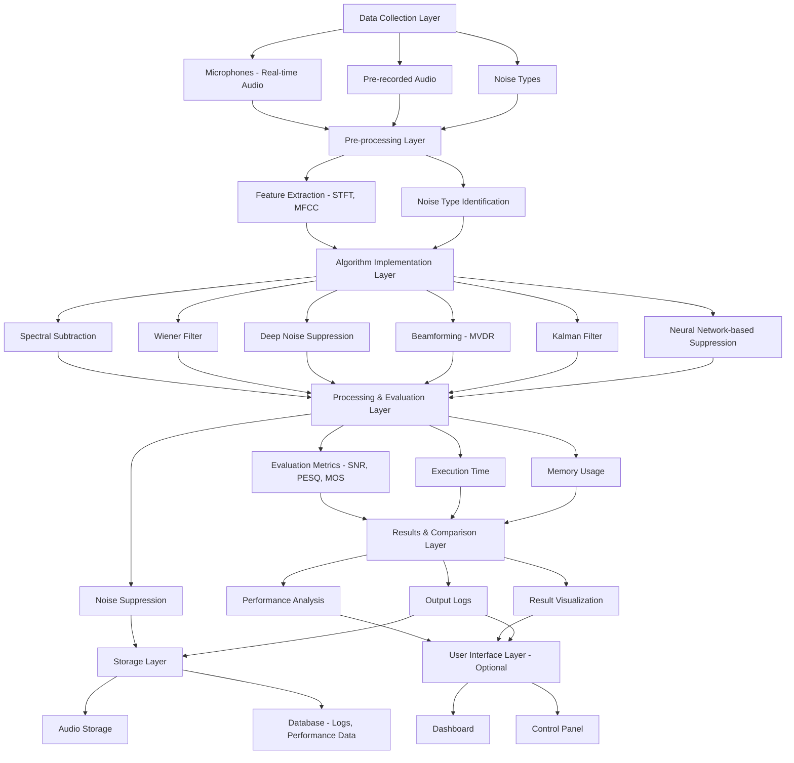

```mermaid
graph TD
    A[Data Collection Layer] --> B1[Microphones - Real-time Audio]
    A --> B2[Pre-recorded Audio]
    A --> B3[Noise Types]
    B1 --> C[Pre-processing Layer]
    B2 --> C
    B3 --> C
    C --> D1[Feature Extraction - STFT, MFCC]
    C --> D2[Noise Type Identification]

    D1 --> E[Algorithm Implementation Layer]
    D2 --> E
    E --> F1[Spectral Subtraction]
    E --> F2[Wiener Filter]
    E --> F3[Deep Noise Suppression]
    E --> F4[Beamforming - MVDR]
    E --> F5[Kalman Filter]
    E --> F6[Neural Network-based Suppression]

    F1 --> G[Processing & Evaluation Layer]
    F2 --> G
    F3 --> G
    F4 --> G
    F5 --> G
    F6 --> G
    G --> H1[Noise Suppression]
    G --> H2[Evaluation Metrics - SNR, PESQ, MOS]
    G --> H3[Execution Time]
    G --> H4[Memory Usage]

    H2 --> I[Results & Comparison Layer]
    H3 --> I
    H4 --> I

    I --> J1[Performance Analysis]
    I --> J2[Result Visualization]
    I --> J3[Output Logs]

    J1 --> K[User Interface Layer - Optional]
    J2 --> K
    J3 --> K

    K --> L1[Dashboard]
    K --> L2[Control Panel]

    H1 --> M[Storage Layer]
    J3 --> M
    M --> N1[Audio Storage]
    M --> N2[Database - Logs, Performance Data]
```